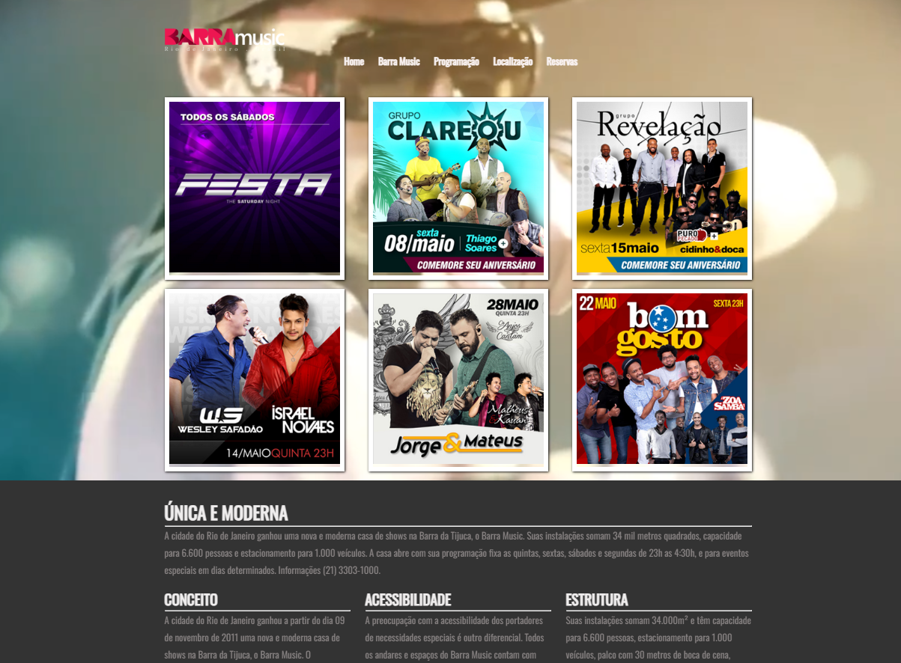
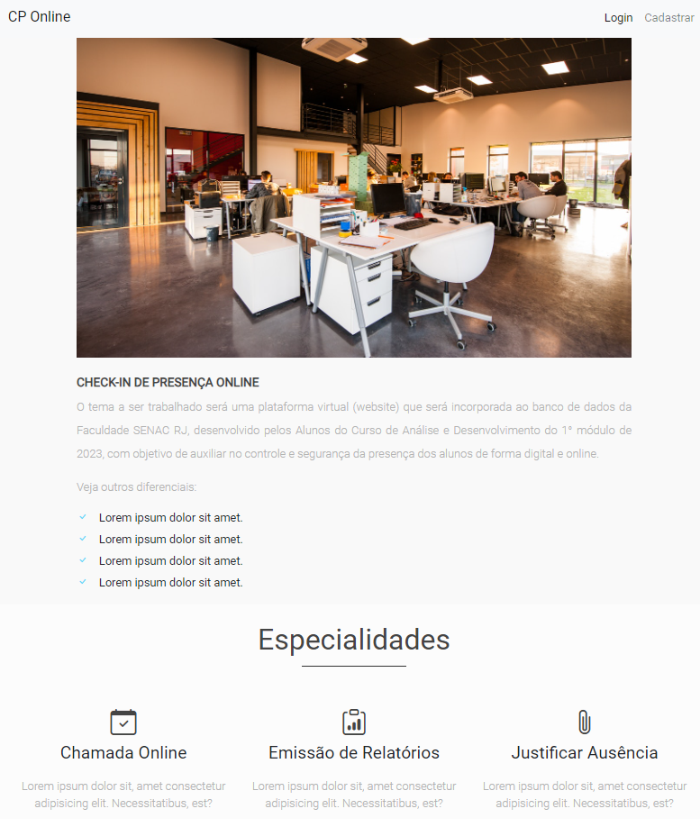
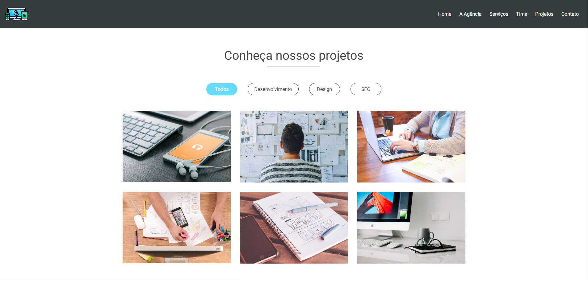
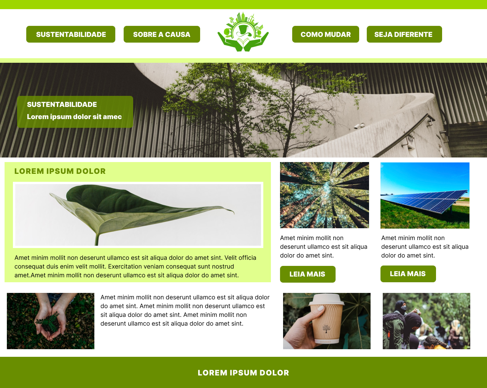
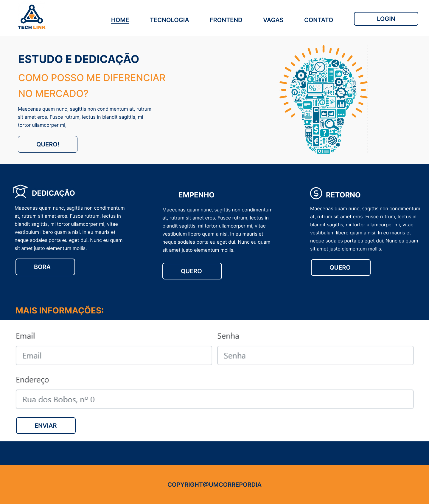

# Frontend Projects Suite

Este repositório contém uma coleção de projetos frontend desenvolvidos utilizando HTML, CSS, Bootstrap e JavaScript. Os projetos variam entre diferentes temas e funcionalidades, demonstrando o uso dessas tecnologias para criar interfaces modernas e responsivas.

## Projetos

1. **ADS Gamers**
   - **Tecnologias**: Bootstrap
   - **Descrição**: Website voltado para o público gamer, utilizando o Bootstrap para criar uma interface responsiva e atraente.
   

2. **BarraMusic**
   - **Tecnologias**: HTML, CSS
   - **Descrição**: Projeto de um site para uma loja de música, focando em um design limpo e moderno com HTML e CSS puro.
   

3. **CP Online**
   - **Tecnologias**: Bootstrap, JavaScript
   - **Descrição**: Plataforma online para serviços diversos, utilizando Bootstrap para o layout e JavaScript para interatividade.
   

4. **Hd Agency**
   - **Tecnologias**: Bootstrap, JavaScript
   - **Descrição**: Website corporativo para uma agência digital, combinando Bootstrap e JavaScript para criar uma experiência de usuário dinâmica.
   

5. **Nature ADS**
   - **Tecnologias**: HTML, CSS
   - **Descrição**: Página dedicada à promoção de produtos naturais, desenvolvida com foco em simplicidade e eficiência, utilizando HTML e CSS.
   

6. **Tech Link**
   - **Tecnologias**: Bootstrap
   - **Descrição**: Projeto de um site voltado para o setor de tecnologia, empregando Bootstrap para um layout responsivo e moderno.
   

## Como Executar

1. Clone este repositório:
   ```bash
   git clone https://github.com/ecalazaes/ProjetosBootstrap.git

2. Acesse o diretório do projeto desejado:
   ```bash
   cd nome-do-projeto
   
3. Abra o arquivo index.html em seu navegador.
   
## Licença

Este projeto está licenciado sob a [MIT License](LICENSE).
